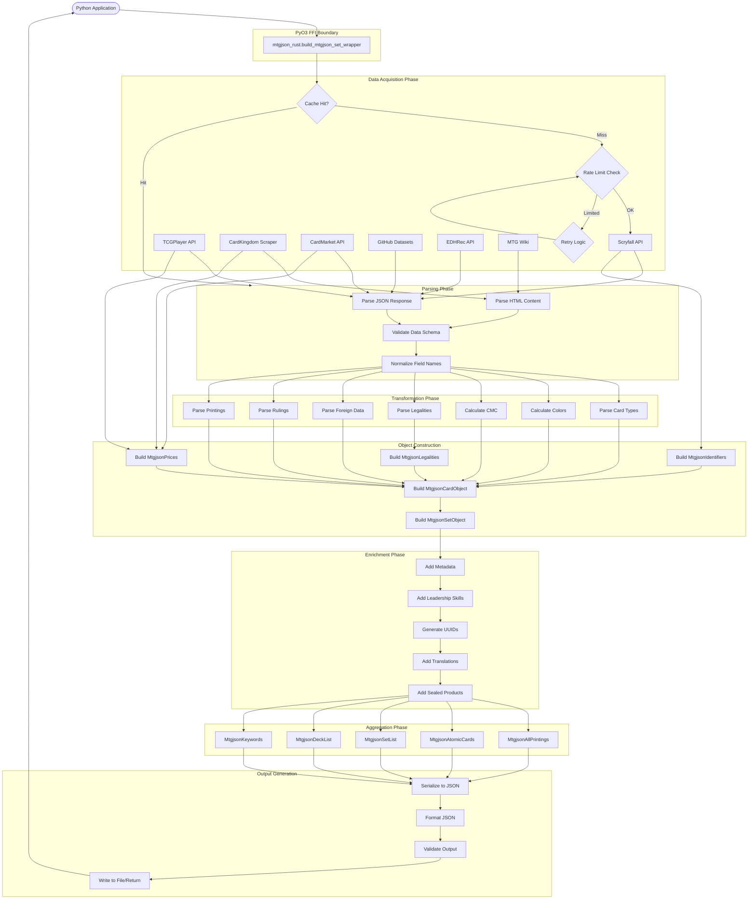
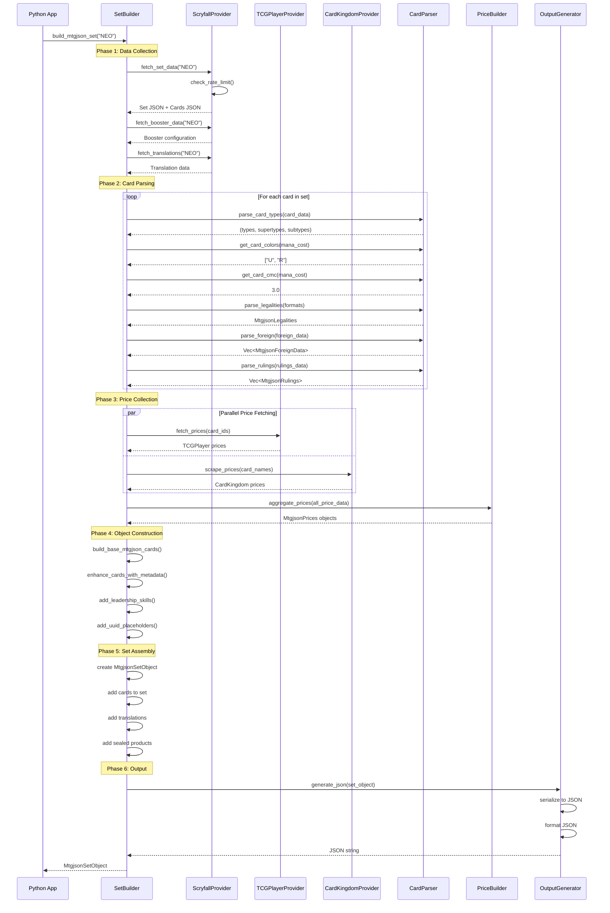
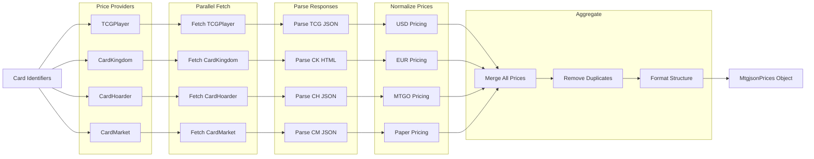
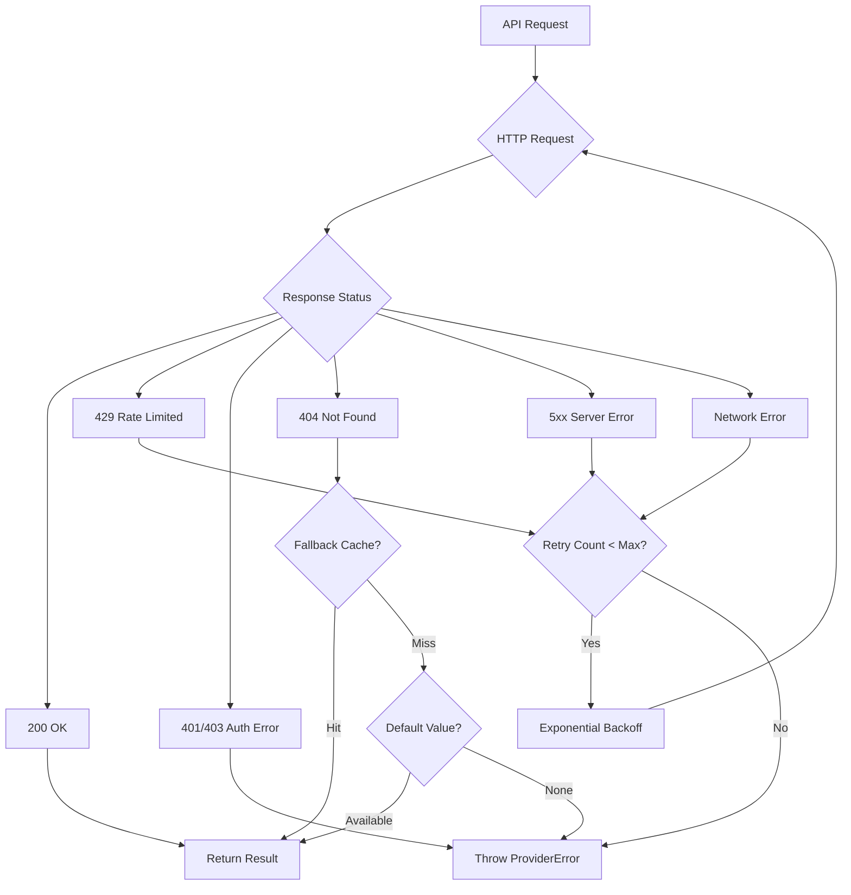

# MTGJSON Rust Data Flow Diagrams

## Complete End-to-End Data Flow



## Set Building Sequence Diagram



## Card Object Construction Flow

```
┌─────────────────────────────────────────────────────────────────┐
│              Raw Scryfall Card JSON                             │
│  {                                                              │
│    "name": "Lightning Bolt",                                    │
│    "mana_cost": "{R}",                                          │
│    "type_line": "Instant",                                      │
│    "oracle_text": "Deal 3 damage...",                           │
│    "legalities": {...},                                         │
│    ...                                                          │
│  }                                                              │
└────────────────────────┬────────────────────────────────────────┘
                         │
                         ▼
         ┌───────────────────────────┐
         │   Validation & Schema     │
         │   Checking                │
         └───────────┬───────────────┘
                     │
                     ▼
    ┌────────────────────────────────────┐
    │     Field Extraction               │
    ├────────────────────────────────────┤
    │ name         → "Lightning Bolt"    │
    │ mana_cost    → "{R}"               │
    │ type_line    → "Instant"           │
    │ oracle_text  → "Deal 3 damage..."  │
    └────────────┬───────────────────────┘
                 │
    ┌────────────┴────────────┬──────────────────┬──────────────┐
    │                         │                  │              │
    ▼                         ▼                  ▼              ▼
┌─────────┐         ┌──────────────┐   ┌─────────────┐  ┌──────────┐
│Parse    │         │Get Colors    │   │Calculate    │  │Parse     │
│Card     │         │from Mana     │   │CMC          │  │Legalities│
│Types    │         │Cost          │   │             │  │          │
└────┬────┘         └──────┬───────┘   └──────┬──────┘  └─────┬────┘
     │                     │                  │               │
     │                     │                  │               │
     │    ┌────────────────┴──────────────────┴───────────────┘
     │    │
     │    ▼
     │  ┌──────────────────────────────────────┐
     │  │   Parallel Processing                │
     │  │   - Foreign data parsing             │
     │  │   - Ruling extraction                │
     │  │   - Printings resolution             │
     │  └──────────────────┬───────────────────┘
     │                     │
     ▼                     ▼
┌──────────────────────────────────────────┐
│     MtgjsonCardObject Assembly           │
├──────────────────────────────────────────┤
│ uuid: "generated-uuid-here"              │
│ name: "Lightning Bolt"                   │
│ colors: ["R"]                            │
│ cmc: 1.0                                 │
│ types: ["Instant"]                       │
│ supertypes: []                           │
│ subtypes: []                             │
│ identifiers: MtgjsonIdentifiers {...}    │
│ legalities: MtgjsonLegalities {...}      │
│ foreign_data: Vec<ForeignData> {...}     │
│ rulings: Vec<Ruling> {...}               │
└──────────────────┬───────────────────────┘
                   │
                   ▼
        ┌─────────────────────┐
        │  Price Enrichment   │
        │  (Async)            │
        └──────────┬──────────┘
                   │
                   ▼
        ┌─────────────────────┐
        │ Final Card Object   │
        │ with all metadata   │
        └─────────────────────┘
```

## Price Aggregation Flow



## Parallel Processing Architecture

```
Main Thread
    │
    ├─> Create Rayon Thread Pool (num_cpus cores)
    │
    ├─> Partition Card Data into Chunks
    │   │
    │   ├─> Chunk 1 (cards 1-100)    ───> Worker Thread 1
    │   │                                       │
    │   │                                       ├─> Parse card types
    │   │                                       ├─> Calculate colors
    │   │                                       ├─> Calculate CMC
    │   │                                       └─> Build card objects
    │   │
    │   ├─> Chunk 2 (cards 101-200)  ───> Worker Thread 2
    │   │                                       │
    │   │                                       └─> (same operations)
    │   │
    │   ├─> Chunk 3 (cards 201-300)  ───> Worker Thread 3
    │   │
    │   └─> Chunk N (cards ...)      ───> Worker Thread N
    │
    ├─> Collect Results (work-stealing scheduler)
    │
    └─> Merge into Final Vec<MtgjsonCardObject>


Async I/O (Tokio)
    │
    ├─> Spawn Multiple Futures
    │   │
    │   ├─> Future 1: Fetch Scryfall Set
    │   ├─> Future 2: Fetch Scryfall Translations
    │   ├─> Future 3: Fetch TCGPlayer Prices
    │   ├─> Future 4: Fetch CardKingdom Prices
    │   ├─> Future 5: Fetch EDHRec Rankings
    │   └─> Future N: Fetch GitHub Data
    │
    ├─> Await All Futures Concurrently
    │
    └─> Combine Results
```

## Error Handling Flow



## Compiled Output Generation Flow

```
┌─────────────────────────────────────────────────────────┐
│         Collection of MtgjsonSetObject (200+ sets)      │
└────────────────────────┬────────────────────────────────┘
                         │
            ┌────────────┴────────────┐
            │                         │
            ▼                         ▼
    ┌───────────────┐         ┌──────────────┐
    │ AllPrintings  │         │  SetList     │
    │               │         │  (metadata)  │
    │ Full sets with│         │              │
    │ all card data │         │ Sets without │
    └───────┬───────┘         │ card arrays  │
            │                 └──────────────┘
            │
            ▼
    ┌───────────────────┐
    │ Extract All Cards │
    └────────┬──────────┘
             │
             ▼
    ┌────────────────────┐
    │ Deduplicate Cards  │
    │ by oracle_id       │
    └────────┬───────────┘
             │
             ▼
    ┌────────────────────┐
    │  AtomicCards       │
    │  (unique cards)    │
    └────────────────────┘
             │
             ▼
    ┌────────────────────┐
    │ Extract Identifiers│
    └────────┬───────────┘
             │
             ▼
    ┌────────────────────┐
    │  AllIdentifiers    │
    │  (UUID mappings)   │
    └────────────────────┘
             │
             ▼
    ┌────────────────────┐
    │ Extract Keywords   │
    │ & Enum Values      │
    └────────┬───────────┘
             │
             ├───> Keywords.json
             ├───> EnumValues.json
             └───> CardTypes.json
```

## Real-Time Processing Timeline

```
Time (seconds)
0.0  │ Start: build_mtgjson_set("NEO")
     │
0.1  ├─> Initialize providers
     │   └─> Setup rate limiters
     │
0.2  ├─> Fetch Scryfall set metadata (async)
     │
0.5  ├─> Fetch Scryfall cards (async, bulk)
     │
2.0  ├─> Parse 300+ cards (parallel, rayon)
     │   ├─> Thread 1: Cards 1-75
     │   ├─> Thread 2: Cards 76-150
     │   ├─> Thread 3: Cards 151-225
     │   └─> Thread 4: Cards 226-300
     │
3.5  ├─> Fetch prices (async, parallel)
     │   ├─> TCGPlayer API (1.2s)
     │   ├─> CardKingdom scrape (2.1s)
     │   └─> CardMarket API (1.5s)
     │
5.6  ├─> Aggregate prices
     │
6.0  ├─> Enrich cards with metadata
     │   └─> Add UUIDs, leadership skills
     │
6.5  ├─> Build set object
     │
7.0  ├─> Generate JSON output
     │
7.2  └─> Return to Python
```

## State Transitions

```
[Uninitialized Provider]
         │
         ▼
[Provider Initialized]
         │
         ├─> Rate Limit Check ──> [Waiting]
         │                            │
         │                            └─> [Ready]
         ▼                                   │
    [Fetching Data] <──────────────────────┘
         │
         ├─> Success ──> [Data Downloaded]
         │                      │
         │                      ▼
         │              [Parsing Response]
         │                      │
         │                      ├─> Success ──> [Parsed Data]
         │                      │
         │                      └─> Error ──> [Parse Failed]
         │
         └─> Error ──> [Network Failed]
                            │
                            └─> Retry ──> [Fetching Data]
                            │
                            └─> Max Retries ──> [Provider Error]
```

## Memory Flow Pattern

```
Stack Allocation
    │
    ├─> Small structures (< 256 bytes)
    │   ├─> Identifiers
    │   ├─> Legalities
    │   └─> Basic types
    │
    └─> SmallVec for small collections
        └─> Color arrays, type arrays

Heap Allocation
    │
    ├─> Large collections
    │   ├─> Vec<Card> (1000+ cards)
    │   ├─> HashMap<String, Price>
    │   └─> String buffers
    │
    └─> Arc for shared data
        └─> Rate limiters, HTTP clients

Zero-Copy Operations
    │
    ├─> JSON parsing (serde_json)
    │   └─> Direct deserialization
    │
    └─> String slices where possible
```

## PyO3 FFI Data Flow

```
Python                    Boundary                    Rust
  │                          │                          │
  ├─> dict/list/str ────────>│─> serde_json::Value ────>│─> Struct
  │                          │                          │
  │                          │   Type Conversion        │
  │                          │   (automatic)            │
  │                          │                          │
  │<── dict/list/str <────────│<── Serialize ───────────│<── Struct
  │                          │                          │
  ├─> Exception ─────────────>│─> PyErr ────────────────>│─> Result::Err
  │<── PyException <──────────│<── ProviderError <──────│
  │                          │                          │
```
