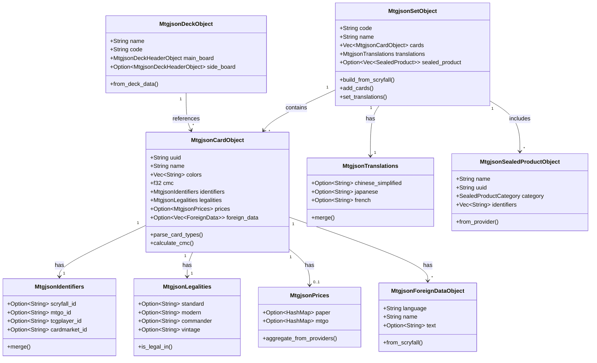
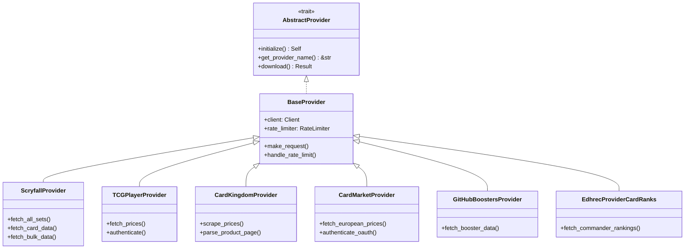
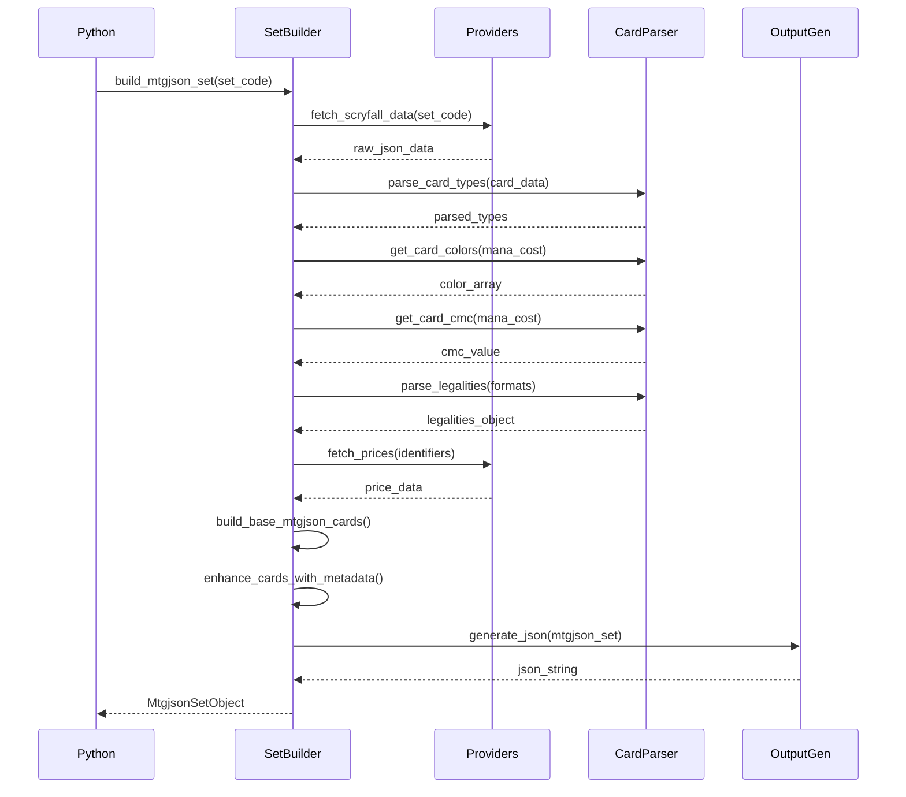

# MTGJSON Rust Module Relationships

## Module Dependency Graph

```mermaid
graph TD
    LIB[lib.rs<br/>PyO3 Entry Point]

    subgraph "Data Structures"
        CLASSES[classes/mod.rs]
        CARD[classes/card.rs]
        SET[classes/set.rs]
        DECK[classes/deck.rs]
        PRICES[classes/prices.rs]
        IDENT[classes/identifiers.rs]
        LEGAL[classes/legalities.rs]
        FOREIGN[classes/foreign_data.rs]
        SEALED[classes/sealed_product.rs]
        TRANS[classes/translations.rs]
    end

    subgraph "Data Providers"
        PROV[providers/mod.rs]
        PROVBASE[providers/provider_base.rs]

        subgraph "Scryfall"
            SCRY[scryfall/monolith.rs]
            SCRYORIENT[scryfall/orientation_detector.rs]
        end

        subgraph "Third Party"
            TCG[third_party/tcgplayer.rs]
            CK[third_party/cardkingdom.rs]
            CH[third_party/cardhoarder.rs]
            CM[cardmarket/monolith.rs]
            MTGBAN[third_party/mtgban.rs]
            GATH[third_party/gatherer.rs]
            WIZ[third_party/wizards.rs]
        end

        subgraph "Community Data"
            GH[github/*]
            EDHREC[edhrec/card_ranks.rs]
            WIKI[mtgwiki/secret_lair.rs]
        end
    end

    subgraph "Processing Pipeline"
        BUILD[builders/mod.rs]
        SETBLD[builders/set_builder.rs]
        SETFUNC[builders/set_builder_functions.rs]
        PRICEBLD[builders/price_builder.rs]
        OUTGEN[builders/output_generator.rs]
        PARALLEL[builders/parallel_call.rs]
    end

    subgraph "Output Formats"
        COMP[compiled_classes/mod.rs]
        ALLPRINT[compiled_classes/all_printings.rs]
        ALLIDENT[compiled_classes/all_identifiers.rs]
        ATOMIC[compiled_classes/atomic_cards.rs]
        SETLIST[compiled_classes/set_list.rs]
        DECKLIST[compiled_classes/deck_list.rs]
    end

    CONST[constants.rs]
    UTILS[utils_functions.rs]

    LIB --> CLASSES
    LIB --> PROV
    LIB --> BUILD
    LIB --> COMP

    CLASSES --> CARD
    CLASSES --> SET
    CLASSES --> DECK
    CLASSES --> PRICES
    CLASSES --> IDENT
    CLASSES --> LEGAL
    CLASSES --> FOREIGN
    CLASSES --> SEALED
    CLASSES --> TRANS

    PROV --> PROVBASE
    PROV --> SCRY
    PROV --> SCRYORIENT
    PROV --> TCG
    PROV --> CK
    PROV --> CH
    PROV --> CM
    PROV --> MTGBAN
    PROV --> GATH
    PROV --> WIZ
    PROV --> GH
    PROV --> EDHREC
    PROV --> WIKI

    BUILD --> SETBLD
    BUILD --> SETFUNC
    BUILD --> PRICEBLD
    BUILD --> OUTGEN
    BUILD --> PARALLEL

    COMP --> ALLPRINT
    COMP --> ALLIDENT
    COMP --> ATOMIC
    COMP --> SETLIST
    COMP --> DECKLIST

    SETBLD --> CLASSES
    SETBLD --> CONST
    SETBLD --> UTILS

    SETFUNC --> SETBLD
    SETFUNC --> CLASSES

    PRICEBLD --> PRICES
    PRICEBLD --> PROV

    OUTGEN --> CLASSES
    OUTGEN --> COMP

    ALLPRINT --> SET
    ALLPRINT --> CARD

    ATOMIC --> CARD

    SETLIST --> SET

    DECKLIST --> DECK

    PROVBASE -.-> SCRY
    PROVBASE -.-> TCG
    PROVBASE -.-> CK
    PROVBASE -.-> CH

    style LIB fill:#ff6b6b
    style CLASSES fill:#4ecdc4
    style PROV fill:#ffe66d
    style BUILD fill:#95e1d3
    style COMP fill:#f38181
```



## Class Relationship Diagram



## Provider Inheritance Hierarchy



## Builder Processing Flow



## Compiled Classes Dependencies

```
MtgjsonAllPrintings
├── MtgjsonSetObject
│   ├── MtgjsonCardObject
│   │   ├── MtgjsonIdentifiers
│   │   ├── MtgjsonLegalities
│   │   ├── MtgjsonPrices
│   │   └── MtgjsonForeignDataObject
│   ├── MtgjsonTranslations
│   └── MtgjsonSealedProductObject

MtgjsonAtomicCards
└── MtgjsonCardObject (unique cards only)
    ├── MtgjsonIdentifiers
    ├── MtgjsonLegalities
    └── MtgjsonForeignDataObject

MtgjsonSetObjectList
└── Vec<MtgjsonSetObject> (metadata only)

MtgjsonDeckObjectList
└── Vec<MtgjsonDeckObject>
    └── MtgjsonDeckHeaderObject
        └── Vec<MtgjsonCardObject>

MtgjsonAllIdentifiers
└── HashMap<String, MtgjsonIdentifiers>

MtgjsonKeywords
└── Vec<String> (ability keywords, card types, etc.)

MtgjsonEnumValues
└── HashMap<String, Vec<String>> (valid enum values)

MtgjsonCardTypesObject
└── HashMap<String, Vec<String>> (card type categories)

MtgjsonTcgplayerSkus
└── HashMap<String, TCGPlayerSKU>
```

## Import/Export Graph

```
┌─────────────────────────────────────────────────────────────┐
│                         lib.rs                              │
│                                                             │
│  Exports:                                                   │
│  ├── All Classes (15+)                                      │
│  ├── All Providers (14+)                                    │
│  ├── All Builders (4)                                       │
│  ├── All Compiled Classes (10+)                             │
│  └── Set Builder Functions (10+)                            │
│                                                             │
│  Imports:                                                   │
│  ├── pyo3::prelude::*                                       │
│  ├── serde::{Serialize, Deserialize}                        │
│  └── Internal modules                                       │
└─────────────────────────────────────────────────────────────┘
                           │
        ┌──────────────────┼──────────────────┐
        │                  │                  │
        ▼                  ▼                  ▼
┌───────────────┐  ┌───────────────┐  ┌───────────────┐
│   classes/    │  │  providers/   │  │   builders/   │
│               │  │               │  │               │
│ Public Types: │  │ Public Types: │  │ Public Types: │
│ - Card        │  │ - Scryfall    │  │ - SetBuilder  │
│ - Set         │  │ - TCGPlayer   │  │ - PriceBuilder│
│ - Deck        │  │ - CardKingdom │  │ - OutputGen   │
│ - Prices      │  │ - CardMarket  │  │ - Parallel    │
│ - Identifiers │  │ - GitHub      │  │               │
│ - Legalities  │  │ - EDHRec      │  │ Functions:    │
│ - ForeignData │  │ - MTGWiki     │  │ - parse_*     │
│ - SealedProd  │  │               │  │ - get_*       │
│ - Translation │  │ Base:         │  │ - build_*     │
│               │  │ - Provider    │  │               │
│ Utilities:    │  │ - RateLimiter │  │               │
│ - MtgjsonUtils│  │ - Error types │  │               │
└───────────────┘  └───────────────┘  └───────────────┘
        │                  │                  │
        └──────────────────┼──────────────────┘
                           │
                           ▼
                 ┌───────────────────┐
                 │ compiled_classes/ │
                 │                   │
                 │ Public Types:     │
                 │ - AllPrintings    │
                 │ - AllIdentifiers  │
                 │ - AtomicCards     │
                 │ - SetList         │
                 │ - DeckList        │
                 │ - Keywords        │
                 │ - EnumValues      │
                 │ - CardTypes       │
                 │ - Structures      │
                 │ - TcgplayerSkus   │
                 └───────────────────┘
```

## Cross-Cutting Concerns

```
┌──────────────────────────────────────────────────────────┐
│                    Serialization                         │
│  All classes implement: Serialize + Deserialize          │
│  Framework: serde + serde_json                           │
└──────────────────────────────────────────────────────────┘

┌──────────────────────────────────────────────────────────┐
│                  Python Bindings                         │
│  All public types use: #[pyclass]                        │
│  All methods use: #[pymethods]                           │
│  Framework: PyO3                                         │
└──────────────────────────────────────────────────────────┘

┌──────────────────────────────────────────────────────────┐
│                   Error Handling                         │
│  Provider errors: ProviderError enum                     │
│  Conversion to Python: impl From<E> for PyErr            │
│  Framework: thiserror                                    │
└──────────────────────────────────────────────────────────┘

┌──────────────────────────────────────────────────────────┐
│                 Async Processing                         │
│  Runtime: tokio                                          │
│  HTTP: reqwest with async                               │
│  Python integration: experimental-async feature          │
└──────────────────────────────────────────────────────────┘

┌──────────────────────────────────────────────────────────┐
│              Parallel Processing                         │
│  Data parallelism: rayon                                 │
│  Work stealing: automatic                                │
│  Thread pool: num_cpus based                             │
└──────────────────────────────────────────────────────────┘
```

## Key Interaction Patterns

### 1. Provider → Classes

```rust
// Provider fetches raw data
let raw_data = ScryfallProvider::download()?;

// Data transformed into MTGJSON classes
let card = MtgjsonCardObject::from_scryfall(raw_data);
```

### 2. Classes → Builders

```rust
// Builder processes multiple cards
let cards = build_base_mtgjson_cards(scryfall_cards)?;

// Enhance with additional metadata
let enriched = enhance_cards_with_metadata(cards, providers)?;
```

### 3. Builders → Compiled Classes

```rust
// Aggregate into compiled format
let all_printings = MtgjsonAllPrintings::from_sets(sets);

// Generate output
let json = OutputGenerator::generate(all_printings)?;
```

### 4. Python → Rust

```python
from mtgjson_rust import build_mtgjson_set_wrapper

# Direct FFI call
set_data = build_mtgjson_set_wrapper("KHM")
```

## Module Size Statistics

```
Module                   Files  Lines (approx)
-------------------------------------------
classes/                   16    ~3,500
providers/                 20    ~5,000
  - scryfall/               2    ~1,200
  - third_party/            8    ~2,000
  - github/                 5    ~1,000
  - other/                  5      ~800
builders/                   5    ~2,500
compiled_classes/          10    ~2,000
lib.rs                      1      ~170
utils/constants             2      ~500
-------------------------------------------
Total                     ~54   ~13,670
```

## Dependency Injection Pattern

```
BaseProvider
    ↓
RateLimiter (injected)
    ↓
HTTP Client (injected)
    ↓
Concrete Provider (TCGPlayer, Scryfall, etc.)
```

Each provider receives:
- Configured HTTP client
- Shared rate limiter
- Error handling middleware
